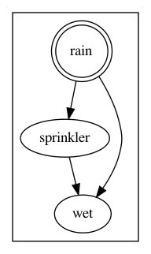

# Bayesian Networks

* [Grass Example](#grass-example)
* [Simple Linnaean Classification Example](#simple-linnaean-classification-example)
* [How a Bayesian Network is Used](#how-a-bayesian-network-is-used)
  * [Vocabulary](#vocabulary)
  * [Well-Conditioned Networks](#well-conditioned-networks)

Bayesian networks represent the relationships between the various elements
in the vector of evidence.
Essentially, if _E_ is made out of sub-components,
_E1, E2, ... En_
the _p(E | H)_ component of [Bayes theorem](index.md#bayes-theorem)
is not necessarily 
_p(E | H) = p(E1 | H) p(E2 | H) ... p(En | H)_
since there will be dependencies between the various sub-components.

## Grass Example

The grass network is shown below

A Bayesian network is direction agnostic. 
However, the  way we use networks, there is a clear sense of hypothesis,
cause and effect and this is shown in the diagram.

This network has three elements:

* Is it raining? (R, conversely, !R means that it is not raining)
* Is the grass wet? (W)
* Is the sprinkler on? (S)

These elements are connected, since the grass will usually
be wet if it is either raining or the sprinkler is on.
However, the sprinkler will not generally be on if it is
raining.

We are going to choose "is it raining?" (R) as the hypothesis
and have (W, S) as the evidence.
We can see whether the grass is wet or if the sprinker is on;
we want to use the information to deduce whether it is raining.
We have the following probabilities:

* _p(R) = 0.2_ - it's raining 20% of the time, 
  so that's what you would expect without further information
* _p(S | R) = 0.01_ - there is very little chance of the 
  sprinkler being on if it is raining
* _p(!S | R) = 1 - p(S | R) = 0.99_
* _p(S | !R) = 0.4_ - if it is not raining, the sprinker may be on
* _p(!S | !R) = 1 - p(S | !R) = 0.6_
* _p(W | R, S) = 0.99_ - if it is raining and the sprinkler is on, 
  it is almost certain to be wet
* _p(W | R, !S) = 0.8_
* _p(W | !R, S) = 0.9_
* _p(W | !R, !S) = 0.01_

If the grass is wet and the sprinkler is not on, then we can
compute:

* _p(W, !S | R) = p(W | R, !S)  p(!S | R) = 0.8 * 0.99 = 0.792_
* _p(W, !S | !R) = p(W | !R, !S) p(!S | !R) = 0.01 * 0.6 = 0.006_
* _p(W, !S) = p(W, !S | R) p(R) + p(W, !S | !R) p(!R) = 0.792 * 0.2 + 0.006 * 0.8 = 0.1632_
* _p(R | W, !S) = p(R) * p(W, !S | R) / p(W, !S) = 0.2 * 0.792 / 0.1632 = 0.9706_

In other words, there is a 97% chance that it is raining.

The grass example is included in the bayesian builder test cases.
See [GrassTest.java](../bayesian-builder/src/test/java/au/org/ala/names/GrassTest.java)

## Simple Linnaean Classification Example

This is a simplified version of the full ALA network.
This models the Linnaean taxonomic hierarchy of
biological scientific names, where species are grouped
into a series of ranks: first a genus, then a family, an order, a class,
a phylum and then a kingdom.
Membership of a family implies membership of an order.

Scientific names are not completely unique.
Homonyms exist, either because the same name is used
in two different places by different codes of nomenclature
(eg. zoological and botanical) or because two people have
used the same name in slightly different ways.
In these cases, an additional piece of information, such
as a kingdom or nomenclatural code, is needed to dismbiguate

The hypothesis in this network is the taxon identifier,
which corresponds to the placing of the scientific name
on the taxonomic tree.
There are a number of other elements, which act as evidence,
some of which will not be present.

There are a number of chains of inference.
* The specific epithet is the species part of a species name,
  the _globulus_ part of _Eucalyptus globulus_.
  If the specific epithet is provided, it should be expected
  to match the information in the scientific name.
* The evidence provided for the scientificName may have been
  misspelled or provided in a slightly different form.
  A soundexed scientific name may detect a match, even
  if the name does not match exactly.
  Either a name match or a soundex match may provide
  evidence but, if the name matches, then the soundex
  automatically matches.
* The chain of implication follows the Linnaean hierarchy.
  If the family is _Myrtaceae_ then it can be expected that
  the order will be _Myrtales_.

## How a Bayesian Network is Used

The baysian builder library can take a specification
of a baysian network and construct a set of java classes
that implement the inference model of the network.
These classes are designed to be able to handle missing
information from both the reference data and the
evidence.

The classes are also designed to minimise the amount of
storage space used to store the reference data and
inference model.
Simply storing every possible combination of presence/absence
of data would cause a combinatorial explosion.
There are 33 observable properties in the full ALA
Linnaean model and every combination of cases would require
_233 = 8.5_ billion cases for each piece of reference  data.
Instead, the network is anaysed for chains of inference that can
be used to restrict the number of parameters that need to be stored.

### Vocabulary

The following terms are used:

* **Observable** An observable property that can be used as evidence.
  An example observable is _genus_ which might have the value
  _genus = Eremophila_
  Also a _vertex_ in graph terms.
* **Observation** A statement that an observable has (or has not)
  one of a set of values.
  In the above example _genus ∈ { Eremophila, Santis }_ or
  _genus ∉ { Aster }_.
* **Hypothesis** An observation that we wish to test, from which
  other information flows.
  For example _taxonId = https://id.biodiversity.org.au/name/apni/106649_
* **Classifier** A related set of observations tied to a particular hypothesis.
  Classifiers have a single preferred value for observables that match the hypothesis
  They may also have variant versions of terms that match observables.
  For example, a classifier may accept _scientificName = Eolophus roseicapilla_ or
  _scientificName = Eolophus roseicapillus_ but the preferred value is _Eolophus roseicapilla_.
* **Parameters** The chain of implications for a specific classifier.
  For example, _p(genus = Eolophus | soundexScientficName = ELOFA ROSICAPILA, scientificName ≠ Eolophus roseicapillus) = 0.75_
* **Classification** A template for evidence.
  Either a partially filled-out template containing the available evidence to test
  or a completed template derived from the preferred data in a classifier, which
  matches the evidence provided.
* **Edge** A cause and effect implication between two observables.
  An edge indicates that the target is conditional on the source.
* **Modifier** An operation that modifies the search classification, removing or
  altering evidence to see whether it will produce a better match.
  Modifiers are needed because the search data being may contain errors.

### Well-Conditioned Networks

The system is deisgned to handle bayesian networks with
the following characteristics.
Using the [Linnaeian network](#simple-linnaean-classification-example) 
for examples:

* There is a single, well-defined hypothesis, the taxonId for example.
  The software can handle multiple observables as a hypothesis
  but you generally shouldn't do that.
* The number of incoming edges for each observable is limited.
  Each edge doubles the number of parameters needed to
  calculate the number of cases needed to compute the
  probability parameters.
  In the Linnaean example, most obaservables have only one
  incoming edge, with genus and scientificName having two.
  Approximately 52 parameters are needed (twice 26, with one set for the
  hypothesis being true and one for it being false).
* The network is _braided._
  Branching chains of implication quickly return to a
  single point.
  In the Linnaean example, scientific name and soundex name
  quickly loop back to genus.
  The compilation process needs to establish a _horizon,_
  a start point for branching implication and include
  every combination of variations within that horizon
  when calculating implications.
  Too wide a branch causes a combinatorial explosion.
* The network is _bushy._
  As far as possible, observables have few chains of
  implication beyond the hypothesis.
  These observables can be treated as independent and this
  minimises the number of parameters needed.

### How a Match Works

The start point for matching is filling out a classification with
whatever information is available.
The more information, the more accurate the match is likely to be.
A (per-network) analyser conditions the data and fills out any obvious extra
information that can be used to guide the search
(eg. the genus name and rank from a binomial scientific name).

The matcher searches a store for candidate classifiers that potentially match the
information provided.
This is implemented by using a lucene index but other data stores can be used.

The candidates are tested against the classification by calculating
the probability that the evidence in the classification matches the classifier.
To do this, we use a number of mathematical tricks.

The first trick is to use

To calculate the evidence probability.
This allows us to break the computation into two parts, conditional on
the hypothesis being true or false.
The prior _p(H)_ can be pre-computed and _p(¬H) = 1 - p(H)_.
In general _p(¬X | Y) = 1 - p(X | Y)_.

The second trick is to divide the computations into _horizons_, individual
chunks of inference that can be computed from a simple set or prior probabilities.
In the Linnaean example, the computation for taxonId (T), specific epithet (S) and
scientific name (N) can be given, with _N_ meansing that the classification scientific
name matches one of the names in the classifier and _¬N_ meaning that it doesn't.

We can then feed _p(N)_ into the next computation for soundex name (X) and genus (G):

(and similarly for _p(¬G)_)
Note that _p(¬N)_ is also required, since it can still contribute to the probability
that _G_ matches.

The above calculation assumes that we have no knowledge about the actual matches
between the classifier and the classification.
If the scientific name does not match but the soundex name does, then _p(N) = 0_ and
_p(¬X) = 0_ and the calculation for _p(G)_ becomes:

The inference model for the network builds a calculation that eliminates dead
branches, based on matching evidence, and interweaves the calculations to quickly
build a final probability.
When all paths are calculated, the result is the product of all the independent branches.

Once the probability of a match is calculated, there can be more than one 
potential match.
A (per-network) matcher analyses the results and sees whether it can eliminate
duplicates or otherwise choose an acceptable match.
Any problems are flagged in a set of URIs that indicate issues and problems.

If that does not work, a sequence of modifiers is used to adjust the candididate,
to see if (for example) removing a misspelled name would produce an acceptable match.
Any modifications are flagged as issues.

The result is, providing success, a match giving a candidate classifier, a classification
constructed from that classifier, the probability of the match being correct and a set of issues.
If the classifier is a synonym (a reference to another classifier) then the 
accepted classifier/classification is provided.
