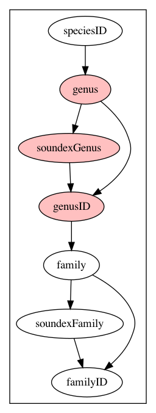
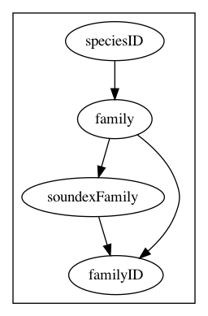

# Defining a Bayesian Network

* [Preliminaries](#preliminaries)
* [Network Definition](#network-definition)
  * [Identification](#identification)
  * [Network](#network)
  * [Normalisers](#normalisers)
  * [Observables](#observables)
    * [Properties](#properties)
    * [Derivations](#derivations)
    * [Groups](#groups)
  * [Vertices](#vertices)
  * [Edges](#edges)
  * [Issues](#issues)
  * [Modifications](#modifications)
  * [Modifiers](#modifiers)
* [Compiling the Network](#compiling-the-network)

Defining a Bayesian network in enough detail that it can be compiled into code
usually requires more detail than simply sketching out the network.
In particular, the type of data that is being stored, what counts as "equivalent"
and how to condition incoming data so that it is consistent usually needs to be
specified, even to the point of saying how to derive the value from other data.

## Preliminaries

If you haven't already, read up on the [vocabulary](bayesian.md#vocabulary) used to
describe various elements.

Before definting the network, you will need to collect the observables that you can use 
and sketch out a [well-conditioned network](bayesian.md#well-conditioned-networks)
that describes the relationships between them.
Not all observables need to be part of the network; you may need to either feed them
back to whatever is doing the search or use them to derive other properties.
From these observables, you will need to identify:

* An _identifier_ the observable that contains a unique identifier for the classifier.
  In a sense, the identifier is used as a stand-in for all the information that the
  classifier contains.
* A _name_ that provides a usable name for the classifier.
* A _full name_ that provides a more formal name for the classifier.
* A _parent identifer_ if the network describes some sort of hierarchical strcuture.
  In the [Linnaean network](bayesian.md#simple-linnaean-classification-example) example,
  a species is contained within a genus, which is contained withing a family, which
  is contained within an order, etc. Possibly with intermediate levels.
  The parent identifier points to the next higher level in the concept tree.
* An _accepted identifier_ if the network contains synonyms.
  Synonyms can contain their own evidence and classifier but they point to the
  accepted version that is in use.
* An _alternative name_ for a classifier.
  This is usually a synonym identified by the accepted identifier but can
  also include alternative spellings
* A _weight_ that contains a weighting value to descirbe how important the concept is.
  Weights are used to calculate prior and conditional probabilities. 
  By default, the weight is 1 and the prior probability is _1/n_ where _n_ is the
  number of classifiers; all possibilities are equally likely.
  Using a weight allows you to declare some animals more equal than others and the
  prior probability is the weight divided by the sum of all weights.

Once you have identified these features, you can start work on an
_analyser_ and _weight analyser_ for the network.
Analysers<sup>1</sup> implement the `au.org.ala.bayesian.Analyser` interface
and allow you to condition incoming information so that it matches properly.
In most cases, the observable defintion can do enough analysis and derivation
to not require specialsed treatment.
Analysers allow you to do more complex and cross-observable treatment.
For example, removing comments in a scientificName.
WeightAnalysers implement the `au.org.ala.names.builder.WeightAnalyser` interface
and allow you build probability weights for the _weight_ observable.
WeightAnalysers can be used to boost specific parts of a heirarchy or pull
information from an ancilliary file.

To begin with, you'll usually have to do this in two parts. 
First write placeholder analysers that do nothing very useful and then,
once the network has been compiled, fill it out using the classes that have
been generated.

<sup>1</sup> Note that we use the Queen's good English in these here parts.

## Network Definition

The basis of a bayesian network is a JSON file that contains a network description.
See the [ALA Linnaean](../ala-linnaean/src/main/resources/ala-linnaean.json) network
for an example.
The file contains the following elements:

### Identification

Most elements, including the network itself, can have the following information:

* **id** A unqiue identifier within the file.
  These identifiers are used to reference other elements in the network
  and to generate variables and constants during code generation.
* **description** A text description of the element.
* **label** A label to use when referencing the element in diagrams, etc.
* **uri** A URI that describes the element.

### Network

As well as identification, the network also contains:

* **concept** A URI describing the concept that the network implements.
  For example, for a taxonomic network, the concept might be
  `http://rs.tdwg.org/dwc/terms/Taxon`
* **vocabularies** A list of classes containing GBIF Term vocabularies that
  should be loaded before analysing the network, as fully qualified class names.
  These vocabularies can be used to provide consistent prefixes to the terms
  that need to be stored in indexes and the like.

### Normalisers

Normalisers can be used to pre-process data for observables, cleaning up
things like strange encodings, inconsistent cases and the like.
A **@class** property identifies the class that the implements the normaliser.
Other parameters are dependent on the normaliser class.
Each normaliser has an `id` thagt can be used to reference the normaliser.

### Observables

The list of observables is the list of attributes that a classifier/classification can have.
Not all of these attributes will be in the actual network.
However, anthing that needs to be included in a classifier and classification needs to
be specified.

An exmaple observable specification is:

```json
{
  "id": "phylum",
  "label": "P",
  "uri": "http://rs.tdwg.org/dwc/terms/phylum",
  "group": "phylum",
  "normaliser": "simple_normaliser",
  "style": "PHRASE",
  "multiplicity": "*",
  "base": {
    "@class": "au.org.ala.bayesian.derivation.ParentDerivation",
    "sources": [ "scientificName" ],
    "condition": {
      "positive": true,
      "observable": "taxonRank",
      "value": "phylum"
    }
  }
}
```

Observables have the id, description, label and uri elements described in
[identification](#identification).
Of these, the id is essential, since observables need to be referenced elsewhere.
A URI is highly encouraged, since it allows the observable to be uniquely described
and allows genus, for example, to be correctly mapped on to
`http://rs.tdwg.org/dwc/terms/genus` rather than be imprecise.

In addition, observables have the following properties:

* **type** The (java) type the observable ghas, defaulting to `java.lang.String`
* **group** A related group of observables that can be assumed to all be present or all be absent.
  Groups are used to reduce the network of cause and effect for classifiers with missing information.
  See [groups](#groups) for more information.
* **normaliser** An optional reference to a [normaliser](#normalisers) to use on the data.
* **style** One of:
  * `IDENTIFIER` - an opaque, case sensitive identifier (eg. taxonId)
  * `CANONICAL` - the default, an string or similar that is treated as a unit but which has a canonical form (eg. all lower case) 
    that can be used to compare non-identical versions (eg. taxonRank)
  * `PHRASE` - a string consisting of units than can be subject to tokenised search (eg. scientificName)
* **multiplicity** One of:
  * `?` - the default, an optional value with zero or one value (eg. taxonomicStatus)
  * `1` - a required value with only one value (eg. taxonId)
  * `*` something with zero or more possible values (eg. family)
  * `+` something with one or more possible values (eg. scientificName)
* **matchability** One of the same values as multiplicity.
  The matchability is usually `?` but, if set to `*` it will allow a set of
  values, all of which will be matched against the classifier.
* **analysis** A reference to an object that interprets the observable so that
  it can be parsed, stored, queried and tested for equivalence.
  By default, this is derived from the type of the observable.
  However, special cases can be specified using this attribute.
  A **@class** property gives the class of analysis to support, which must be a subclass
  of `au.org.ala.bayesian.Analysis` with additional properties, if needed to
  configure the analysis object.
* **derivation** If this observable is derived, not given, then how this derivation takes place.
  A **@class** property gives the class of derivation that needs to be implemented.
  Generally, there is a **sources** list that gives the observables that are used
  to construct the derivation and any other parameters that are needed. 
  See [derivations](#derivations), below for more information.
* **base** A source of copied data for hierarchies; a form of derivation.
  If a parent classifier can be specified, then the list of parents can be searched
  for information that would flesh-out the classiifer.
  As an example, if you have a species classifier, the parents can be searched
  for a family classifier.
  If found, the scientificName of the family classifier can be copied into the
  family observable of the species classifier.
  Generally, a base consists of an object the implements the derivation, with a
  **@class** property that contains the type of derivation, a **sources** list
  that gives the observable to get the information from and a
  **condition** that specifies which parent to derive the information from.
* **properties** Additional properties that provide information about nature of the observable.
  See [properties](#properties) for more information.

#### Properties

The properties section of an observable provides descriptive properties that
the network compiler can use to identify the elements described in [preliminaries](#preliminaries).
An example observable with properties that specify that it is the identifier is:

```json
  {
    "id": "taxonID",
    "label": "tID",
    "uri": "http://rs.tdwg.org/dwc/terms/taxonID",
    "properties": {
      "http://ala.org.au/bayesian/1.0/identifier": true
    },
    "style": "IDENTIFIER",
    "multiplicity": "1"
  }
```

A property is a URI and a value.
The following properties are recognised by the network compiler.
Most properties are boolean values but the model allows for further properties of
any type.

* `http://ala.org.au/bayesian/1.0/weight` This observable provides the classifier weight.
* `http://ala.org.au/bayesian/1.0/identifier` This observable is the classifer identifier
* `http://ala.org.au/bayesian/1.0/name` This observable provides the name of the classifier.
* `http://ala.org.au/bayesian/1.0/fullName` This observable provides the full, formal name of the classifier.
* `http://ala.org.au/bayesian/1.0/altName` This observable holds alternative names for the classifier.
* `http://ala.org.au/bayesian/1.0/synonymName` This observable holds synonym names for this classifier.
* `http://ala.org.au/bayesian/1.0/broadSynonymName` This observable holds broadened alternative names for the classifier. See [Broadeners](#broadeners)
* `http://ala.org.au/bayesian/1.0/disambiguator` This observable holds additional, disambiguating information about a name. 
  For example, the scientificNameAuthorship field holds additional information 
  about how the scientificName and taxonId should be interpreted.
* `http://ala.org.au/bayesian/1.0/parent` This observable provides the reference identifier to the parent classifier.
* `http://ala.org.au/bayesian/1.0/accepted` This observable provides the linking reference to the
  accepted classifier in the case of a synonym.
* `http://ala.org.au/bayesian/1.0/copy` Informtion that should be copied to a synonym from the accepted classifier.
  This property can be used to fill out clarifying infomation for something that has it missing.
  For example, the kingdom is copied from an accepted taxon to a synonym to provide a stable form of disambiguation
  if there is not enough contextual information.
* `http://ala.org.au/bayesian/1.0/additional` The is an observable that does not particpate in the 
  Bayesian network but which needs to be included in the final classification.
  As an example, taxonomicStatus is not used during matching but needs to be provided with the match.
* `http://ala.org.au/bayesian/1.0/link` This is a link property for information derived from parent-child data.
  If there are different opinions about what the value of this property should be, the parent takes precidence.
  Otherwise, weird things can happen.

As well as the Bayesian properties, there are optimisation properties that
can be used to improve performance.

* `http://ala.org.au/optimisation/1.0/load` Do not load values from source documents.
  Instead, rely on derived information from the hierarchy.
* `http://ala.org.au/optimisation/1.0/luceneNoSearch` Do not include this observable
  when searching a Lucene index.
  This can be used for observables that are naturally ranges; Lucene tends to make a
  slow job of searching for these values.
* `http://ala.org.au/optimisation/1.0/aggregate` Aggregate values when loading values
  from a Darwin Core Archive extension.
  This property can have the following values:
  * `first` Use the first non-null value. The default.
  * `max` Use the largest value for an observable with a comparable type.
  * `min` Use the smallest value for an observable with a comparable type.
* `http://ala.org.au/optimisation/1.0/dwcaOrder` The name of a class that will be
  used to order values when using `http://ala.org.au/optimisation/1.0/aggregate`
  The class needs to implement `java.util.Comparator<org.gbif.dwc.record.Record>` 
  for the type of object being aggregated.
  Otherwise, the natural ordering is used.
* `http://ala.org.au/optimisation/1.0/dwcaFilter` The name of a class that will be
  used to filter values when using `http://ala.org.au/optimisation/1.0/aggregate`
  The class needs to implement `java.util.function.Predicate<org.gbif.dwc.record.Record>` 
  for the type of object being aggregated.
* `http://ala.org.au/optimisation/1.0/checkPresentInClassifier` If true, only classifiers
  that contain values that are part of the observable's group (see above) will be
  considered as candidates. This allows you to specify that you must have a category
  of observables in the answer, if the search classification contains a value.
  This can be useful in eliminating matches that would match but are overly vague.
* `http://ala.org.au/optimisation/1.0/approximateName` This observable holds an approximate name (eg. soundex or stem)
  that can be used to pre-filter candidates.

#### Derivations

Derivations are used for two main purposes.
The first is to provide derived versions of observables from other observables.
For example soundexFamily is derived from the family via the following derivation:

```json
{
  "id": "soundexFamily",
  "label": "xF",
  "uri": "http://ala.org.au/terms/1.0/soundexFamily",
  "group": "family",
  "multiplicity": "*",
  "derivation": {
    "@class": "au.org.ala.names.TaxonNameSoundexDerivation",
    "sources": [ "family" ],
    "rank": "FAMILY"
  }
}
```

In this case, the derivation generates a soundex (using the taxamatch algorithm)
from the name in family, based on a rank of FAMILY, since the taxamatch algorithm
that we use varies slightly depending on the rank of the name.

Derivations must inherit from `au.org.ala.bayesian.Derivation` but can be specified
to have multiple parameters, including other observables.
Derivations generate code, which is embedded into the classification and builder
classes that then perform the derivations directly.
If a derived value is provided, then no derivation is run.

Derivations can be _generators_ where a value is automatically generated for a classifier if it is not present.
Generators are run before any analysis and other derivation is done, 

The other main use of derivation is to copy values from a parent in a hierarchical
classification scheme.
An example of a copy derivation is

```json
{
  "id": "family",
  "label": "F",
  "uri": "http://rs.tdwg.org/dwc/terms/family",
  "group": "family",
  "normaliser": "simple_normaliser",
  "style": "PHRASE",
  "multiplicity": "*",
  "base": {
    "@class": "au.org.ala.bayesian.derivation.ParentDerivation",
    "sources": [ "scientificName" ],
    "condition": {
      "positive": true,
      "observable": "taxonRank",
      "value": "family"
    }
  }
}
```

In this case, the base derivation copies a value from a parent classifier.
The particular classifier is chosen by a condition that specifies that
an particular observable in the parent (the taxonRank) has a specific value (family).

The analyser can also be used to derive values in a more ad-hoc fashion.
When building a classifier, the sequence is:

1. Generator derivations are executed during loading
2. Any parent information is gathered
3. The analyser is run over a classification generated from the classifier.
4. Other derivations are executed

#### Groups

It is possible for classifiers to be completely missing information on which inference depends.
For example, in the following fragment of the ALA Linnaean network, all of the genus information is missing.



The approach taken by the network compiler is to generate sub-networks with the missing observables
removed and dependencies shifted down to the nearest immediate antecedents in the graph.
In the above example, the resulting sub-graph will be



_Groups_ specify related observables that can be removed from the graph as a single operation.
Classifiers contain a _signature_ which shows which groups are present and which are absent.
During inference, the signature determines which sub-graph will be used when computing probabilities
and parameters.
Each subgraph generates a separate class for inference and each combination of group
presence or absence generates a subgraph.
So use groups sparingly.

### Vertices

The vertices are simply a list of the observables (via id) that take
part in the Bayesian network.

### Edges

The edges are a list of cause-effect relationships within the network.
An example edge is

```json
{ "source": "genus", "target": "genusID",  "edge": { } }
```

Where the **source** specifies the cause observable, the **target** the
effect observable and the **edge** contains additional information (currently always empty).
The above example is a statement that the genus name affects the genus identifier.

### Broadeners

Broadeners provide a mechanism for slipping a bit up and down the hierarchy
when determining synonyms.
Broadeners may be useful when the person supplying data for analysis might be
using slightly different terms to the reference vocabulary.
For example, a user might give *Lambeth* as a city where the reference vocabulary
treats it as a municipality.
As another example, *Hylidae* might be supplied as a family where a taxonomy regards it as a subfamily.

Broadeners work during the synonym construction phase, pulling additional
names and synonyms from parents or children and adding them to an observable
marked with the `http://ala.org.au/bayesian/1.0/broadSynonymName` property.
Names from this observable can then be pulled in when expanding the data
in the hierarchy.

A typical broadner looks like

```json
{
  "broaden": {
    "@class": "au.org.ala.bayesian.condition.ValueCondition",
    "source": "taxonRank",
    "value": "family"
  },
  "condition": {
    "@class": "au.org.ala.bayesian.condition.CompositeCondition",
    "all": false,
    "conditions": [
      {
        "@class": "au.org.ala.bayesian.condition.ValueCondition",
        "source": "taxonRank",
        "value": "superfamily"
      },
      {
        "@class": "au.org.ala.bayesian.condition.ValueCondition",
        "source": "taxonRank",
        "value": "subfamily"
      }
    ]
  }
}
```

The `broaden` entry gives a condition that descibes the concept that will
be broadened.
In the example above, anything with a taxon rank of family will be broadened.

The `condition` entry gives a condition that determines which parents and children
will be added as potential matches.
In the example above, any parent or child with a superfamily or subfamily rank
will be treated as "near-enough" for the purposes of matching a family name.

The broadener will work up the parent chain and down through children until the
condition is no longer satisfied.
For example, if the concept tree had `family < subfamily < infrafamily` then the
subfaimily would be included and the broadening would stop at infrafamiy.
If the concept tree had `family < semifamily < subfamily < infrafamily` then the
subfamily would not be included, since broadening would stop at semifamily.

### Issues

Issues are statements about various problems encountered when matching information,
ranging from the minor (eg, `http://ala.org.au/issues/1.0/canonicalName` which means
that the name had to be parsed into components) to the slightly more catastrophic
(eg. `http://ala.org.au/issues/1.0/unresolvedHomonym` which indicates that a
name might apply to multiple, widely distibuted taxa).

Issues contain the elements in [identification](#identification).
They must contain a URI, which is used to precisely describe the nature of the issue.

### Modifications

Modifications are actions that can be used to modify a template classification,
so that problems like misspellings, inaccurate data and the like can be handled
in a controlled manner.

A typical modification is

```json
{
  "@class" : "au.org.ala.bayesian.modifier.RemoveModifier",
  "id" : "misspelled_scientific_name_base",
  "issues" : [ "misspelled_scientific_name" ],
  "condition": {
    "@class" : "au.org.ala.bayesian.condition.PresentCondition",
    "all": false,
    "present": [
      "kingdom",
      "phylum",
      "class",
      "order",
      "family"
    ]
  },  
  "observables" : [ "scientificName", "genus", "specificEpithet" ]
}
```

As might be expected, there is a class that implements the modifier,
provided by the **@class** property, possibilities from the [identification](#identification)
section, an associated issue (since modifying the template implies that something is wrong)
and implementation-specific configuration.
In the example, the modifier sets to null the scientificName, genus and specificEpithet
values, if they exist, allowing inference to occur based on the soundex branches.
However, it will only trigger if one of the higher order values has been set.

### Modifiers 

Modifier lists give the order and mixture in which modifications can be applied.
In general, the modifier lists are a list of lists.
If a modifier can be applied to a template classification, then the modification
process will try each combination of one element from each list (with an implicit
element of no modification in each list).

There are two lists of modifiers.
The **sourceModifiers** list gives modifications to be applied before searching
for candidates and is used for fairly serious surgery to the search that will
require building a new collection of candidates, such as searching for a higher-level 
match than the supplied name.
The **matchModifiers** list gives modifications that can be applied without
re-querying the store for candidates and covers things like misspelled names, 
inaccurate ranks and the like.

An example modifier list is shown below:

```json
{
  "matchModifiers": [
    [
      "remove_order",
      "remove_class",
      "remove_phylum"
    ],
    [
      "remove_order",
      "remove_class",
      "remove_phylum"
    ],
    [
      "remove_authorship"
    ],
    [
      "misspelled_scientific_name_base",
      "misspelled_scientific_name_full"
    ],
    [
      "remove_rank"
    ]
  ]
}
```

If applied to the following template

```yaml
scientificName: Acacia dealbata
soundexScientificName: AKACA DELBATA
scientificNameAuthorship: Link
genus: Acacia
soundexGenus: AKACA
taxonRank: species
order: Fabales
```

Then the sequence of application is:

1. none
2. remove_rank
3. mispelled_scientific_name_base
4. misspelled_scientific_name_base, remove_rank
5. misspelled_scientific_name_full
6. misspelled_scientific_name_full, remove_rank
7. remove_authorship
8. ...
9. remove_order, remove_authorship, misspelled_scientific_name_base, remove_rank
10. ...

At the end of step 9, the template would be:

```yaml
soundexScientificName: AKACA DELBATA
soundexGenus: AKACA
```

## Compiling the Network

The easiest way to compile the network is to use the maven plugin.
See [here](../bayesian-maven-plugin/README.md) for more information.

It is good practice to compile the network into at least three modules:

* The _model_ is what client applications can use.
  It contains enough code that a list of candidates can be analysed and
  probabilities computed. (ala-linnaean)
* The _builder_ contains the code needed to build an index with conditional
  probabilities, based on loaded data from some source of data. (ala-linnaean-builder)
  Keeping this as a separate module allows client applications to not have to load
  a vast collection of libraries largely concerned with the compiling and building
  of classifier data.
* The _matcher_ links the model to a persistent data store and provides
  specialist analysis and matching of the matched candidates. (ala-namematching)